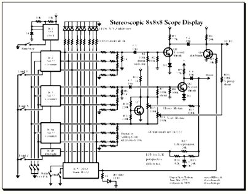
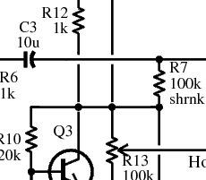

# rubyschem
Ruby and Postscript files for drawing electronics schematics

This is a way of drawing electronics schematics.

**note** At this time, 2015-Mar-16, I have not been able to find the file dswschemextras.rb - so chances are this isn't going to work!  Maybe it can be reconstructed...

##What It Does
Given a description of a complex electronic circuit in a Ruby file, RubySchem creates a Postscript file suitable for printing, turning into a PDF or image, or incorporating into other documents.   

The idea is like LaTeX or Lout or POV-Ray, where users are assumed to enjoy writing text files full of detailed markup, and then running commands.   This is not a point/click/drag GUI app!  

To use this, you actually need to start by drawing a schematic by hand.  Duh-what!?  So what's the point?  The point is to make a nice looking schematic suitable for publication, much like LaTeX is used for making nice looking papers for academic publication which may written by hand if you like. You don't like?   Me neither. My handwriting is inside-out spastic chicken scratching produced during an earthquake.  

Since you'll be writing a Ruby script file by hand, you can still tell everyone that you made your schematic by hand, without a ruler.  They will be impressed!  

So far, RubySchem has been used only on Linux.  Any unix-like system with commonly used postscript tools and Ruby 1.8/1.9 ought to work. 

##How it works
For your schematic drawing project, you write a .rb file which consists mostly of x, y coordinates and instructions to draw components, connections, and labels.   The dswschem.rb file provides a Schematic class with methods to draw parts and do other useful things.  To draw an NPN bipolar transistor, you invoke 

    sch.npn  ["Q1", "Y coord", "shrink"], ">",  [x20,y5], [x21,ye], [x21,y25]  

'sch' is an instance of Schematic.  Normally you have just one. I've never found a reason to use two.  The first arg following is the label, which may be just a simple string, or a list of any number of strings (usually two or three).

The second arg is one of "<", ">", "^", "V", "C" and possibly a few other choices.  This is the label's location relative to the part symbol.  The first four are like arrows pointing the way.   "C" puts the label at the center, which is useful for empty boxes representing ICs or generic functional blocks.

Then follows three [x,y] points.  These are places where the B, E, C leads join.  Normally the E and C x coordinates are the same.  If they're not, I don't know what disaster will happen.  

    
Here's a longer chunk of typical RubySchem code:

   sch.line x21, [y,y20]
   sch.line x23, [y,y20]
   sch.resistor ["R18", "82k"], "V", [x21, xmid],  y
   sch.resistor ["    R19", "    24k"],  "V", [xmid, x23],  y
   ycapbot = y32-0.7*partsp
   sch.cap ["", "", "C5", "10u"], ">", xmid, [y,ycapbot]
   sch.gnd [xmid, ycapbot], [xmid,ycapbot]
   sch.dot x21, y20

You will use a lot of Schematic.line, Schematic.dot, and Schematic.gnd.   Line are, of course, lines. Duh, obvious.  You give it two x coords in a list and one bare y coord, or one bare x and a list of two y coords.

What are all those "x21" and "y20"?  Coordinates for the wiring and other major components.

Resistors, Capacitors, Diodes etc. all work that way.  One of x or y is a list of two values, and the other a bare number.   Can RubySchem draw parts at angles, for example along a 45 degree diagonal?  I don't recall.  That would be useful for full wave rectifiers and ring modulators.

A "dot" puts a fat dot where a horizontal and a vertical line cross. Well, you can put a dot anywhere, but normally you choose to feed the dot x,y coordinates of such an intersection. This dot indicates connection.

Where there's no dot applied to crossing lines, you have one line passing over the other, automatically.  Really, every line has a wide white carpet under it.  The line passing over paints white over part of the line underneath, making the under-passing line look like it has a gap.  This fails miserably if you'll be printing your schematic on colored paper. Oh well.

A resistor is given two x values and one y, if it is horizontal, or one x value and two y, if it goes vertically.   These x,y coordinates are typically for points anywhere along the line representing electrical connection to other parts.  You don't need to think about exactly where the resistor goes.  It'll usualy appear midway between the two [x,y] points you give.

The dswschem.rb file defines handy units:  inch, cm, minsp (smallest spacing between parallel wiring lines) and some others.   Note that good proper Ruby code would have $inch, $minsp etc. but I've defined functions with non-dollared names to make writing schematic layouts easier.

It's best to start from the left and work right for x coords, or bottom and work up for y.  The first is set to something like an inch for a margin.  The next x2 is x1 plus something - the spacing between parts or lines, usually. Schematic provides minsp, bunch(), and tween() to make your life easier.  Here's a snip from the Stereo888 example's file:
'''
x1 =  0.7*inch
x2,x3,x4 = bunch(3, x1 + partsp, minsp*1.25)
x5 = x4+minsp
x9 = x5+partsp*1.45
x6,x7,x8 = tween(3, x5, x9, 0.5*minsp)
xleds123=bunch(3, x9+0.2*inch, 1.3*minsp)
xleds456=bunch(3, xleds123.last+0.24*inch, 1.27*minsp)
xleds789=bunch(3, xleds456.last+0.24*inch, 1.27*minsp)
x11 = xleds789.last + minsp*0.7
'''

##How to Use This in Detail

Grab the files in src/
(The file dswschem.rb refers to the file dswschemextras.rb, which seems to be missing.)

Draw a rough schematic by hand.  Okay to be sloppy, crooked.   Draw vertcial and horizontal lines at key places - major wiring lines, sides of boxes, where a series of LEDs should be aligned.   I use a blue Prismacolor (colored pencil) for the horizontal lines, and pink for the verticals.  Number them 1, 2, 3, ... or use clever names if you like.

(I'd post an image here but will need some time to find it. Pester me, remind me!)

Start a text editor to make a file named __projectname__.rb in which you will describe your schematic.   You need only a couple lines of prelude before getting into the good stuff:
'''
#!/usr/bin/env  ruby  
# Foobar project schematic using RubySchem
require 'dswschem'  
'''

Write a long series of variable assignments for all the x coordinates, then for all the y.
Go prowl around in the examples/ directory for examples.

Then create a Schematic instance.  This takes a title and a page size.  

Use the Schematic object to draw lines, dots, parts, labels and text blocks. 

At then end of your Ruby script, put

    sch.done
    
Execute your script.  Unless I forgot something, and I probably did, you should quickly have a new .ps file in your current directory.   

Use ps2pdf to create a PDF, Ghostscript, GIMP or whatever to read the .ps or .pdf to rasterize and save as a .png, .jpg, or other image format.

##Cautions, Problems, Bugs, Idiocies and Sources of Frustrations
9. dswschem.rb requires dswschemextras.rb, which I can't find anywhere.  Either it's a tiny nearly empty file you don't really need, or it isn't.  In the latter case, you are screwed, and so am I.   It may be on some old external drive backup here.  Maybe I can reconstruct it from the .ps files I've made.
9. I dusted off these files in order to draw schematics involving NE2 neon discharge bulbs, but there's no symbol in RubySchem for that. Not yet.  The fate of that hangs in a balance of terror between having to work to write code for drawing NE2, and just not bothering with it at all, thereby failing to impress anyone.  
9. There is no way to put out a schematic in a form suitable for rendering in Javascript/HTML5 Canvas.  Not yet.  That would be a fine thing to do.
9. This is just about the only thing I've ever used Ruby for.  I am not a Ruby genius, don't routinely have beer with Matz, clueless about Rails, the most popular use for Ruby the last ten years.   But it's a slick language, fun to write with, elegant.  I hate languages that get fundamentalist about OO, forcing everything into that mold as Java or C# do, but Ruby makes OO so simple and slick, even I like it.   Anyway, the point is, I'm not a Ruby guru so you may find that I have idioted in various ways within dswschem.rb.

##History
Vector drawing tools such as Inkscape didn't look good and don't understand connections and go-overs.  Moving a part or several became a mess of work straightening out wiring.  Software dedicated to electronics design or simulation, such as [QUCS](http://qucs.sourceforge.net/), are great tools for education, experimenting and engineering, but the schematics didn't look great.  

So I started writing, by hand, a Postscript file.  I defined ways to draw resistors, transistors, and other parts. Then I found it a pain to be always putting in numbers for locations, so I created a long sequence of x and y variables. (This way of specifying layout came from some older POV-Ray work I did drawing 3D views from architectural floor plans.)   

After gathering up standard common PS code such as for drawing parts into a separate file, and looking at what I had left, which wasn't pretty, I thought of ways to make it simpler, easier to use.   After some fumbled attempt in Python, I found Ruby to provide a nice way of doing things.   So I wrote a Schematic object which could be told to draw things and where, and then produce a project-specific Postscript incorporating the predefined PS drawing code.   This was all done in, I think, 1997 or 1998.

The first non-trivial project I drew a schematic for was the [Perfect Sine Wave Generator](http://www.darenscotwilson.com/spec/sine/sine.html)   Later, I made a schematic using RubySchem when writing a web page about my experimental  in 2009, a good couple decades after the project itself.

##Contact
darenw@darenscotwilson.com
personal website: http://www.darenscotwilson.com/
Linkedin: http://www.linkedin.com/pub/daren-wilson/8/2a2/b42 
